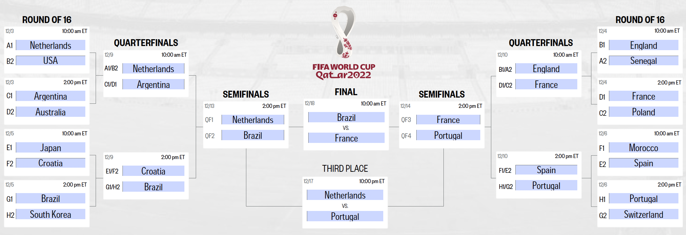

# awful_world_cup_predictor

This program is made because my office likes FIFA too much, so we had to make brackets for the World Cup.
I don't know anything about soccer, FIFA, or even the World Cup, so here's my poor attempt.
I based predictions based on, first and foremost, the FIFA ranking, but also win-draw-loss record in the FIFA World Cup.
It is a rather simple model, but I also use static variables.
To make the program look nicer, I will be making changes such as the use of pointers. I also need to update the descriptions for functions I have used.

Below is the bracket my program created.

